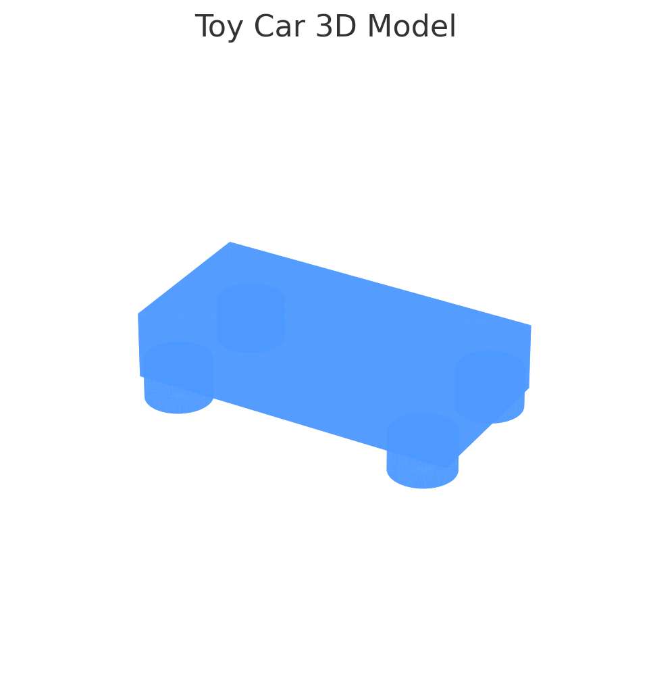
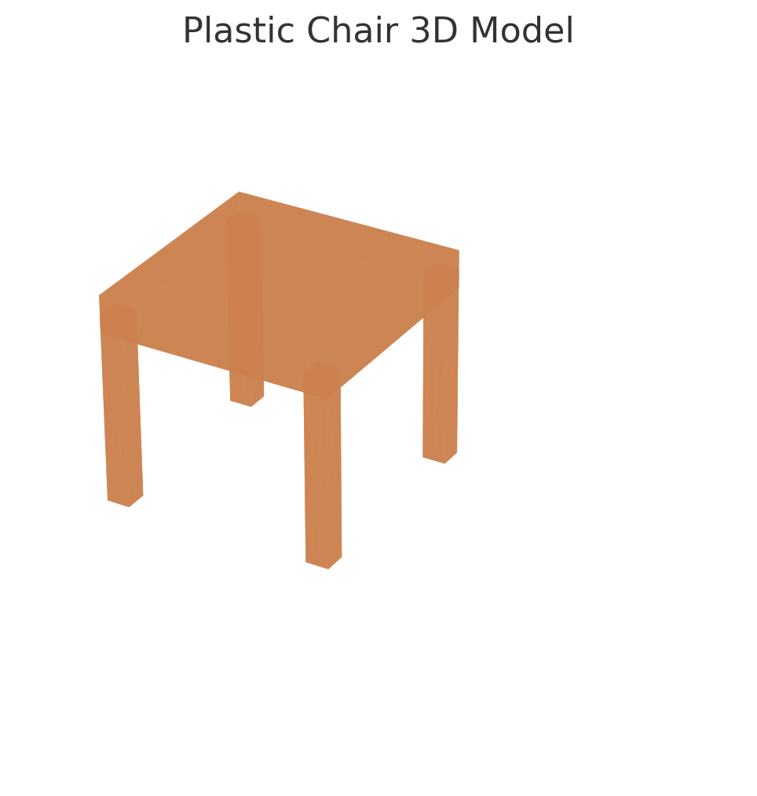

3D Model Generator 🚗

This project is a simple prototype that generates a basic 3D model of a toy car using Python libraries such as `trimesh`, `numpy`, and `matplotlib`.

1. Features

- Procedural generation of a toy car using geometric primitives.
- 3D visualization using `matplotlib` (compatible with Google Colab).
- Exports the model as a `.obj` file for viewing or 3D printing.

2. How to Run

(a) Install dependencies:
	bash
	pip install -r requirements.txt

(b) Open `3dmodel.ipynb` in Jupyter or Google Colab.

(c) Run all cells to generate and visualize the 3D toy car.

3. Output

- `toy_car.obj`: Exported 3D model.
- `toy_car_screenshot.png`: Rendered screenshot of the toy car mesh.
- `chair.obj`: A simple plastic chair generated from geometric primitives.
- chair_screenshot.png :Rendered screenshot of the plastic chair mesh.

4. Thought Process

This prototype demonstrates converting a simple input prompt ("car") into a 3D shape using programmatic geometry. Future enhancements could include:
- Text-to-3D generation using open-source AI models like DreamFusion or Meshy.
- GUI input options via Streamlit or Gradio.
- Image-based object extraction and 3D model matching.

5. Screenshot

Plastic Chair

- `chair.obj`: A simple plastic chair generated from geometric primitives.

Created as part of a 3D AI Prototype Assignment.
